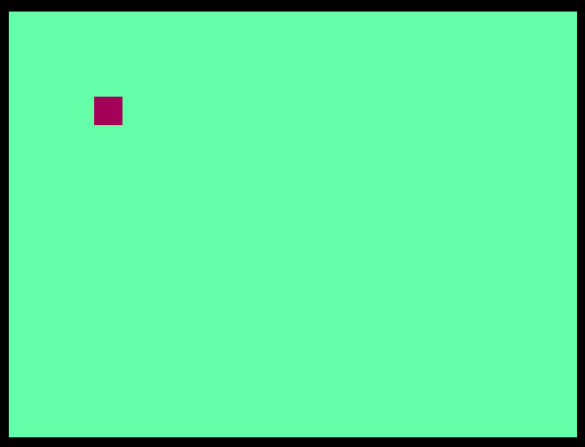

<!---

This file is used to generate your project datasheet. Please fill in the information below and delete any unused
sections.

You can also include images in this folder and reference them in the markdown. Each image must be less than
512 kb in size, and the combined size of all images must be less than 1 MB.
-->

## How it works

- Uses the [HVSync Generator from TinyTapeout](https://github.com/SagarDevAchar/vga-playground/blob/main/src/examples/common/hvsync_generator.v)
- Keeps track of pixel position and directions and flips them when necessary

## External hardware

- [Leo's TinyVGA Pmod](https://github.com/mole99/tiny-vga) connected to OUTPUT terminal (`uo_out`)
- Some switches to the INPUT terminal (`ui_in`)

## How to test

- Connect the necessary peripherals
- Provide a 25MHz clock to the top module `tt_um_micro_one_pixel_dvd_sda`
- Set input bits 7 and 6 to choose the starting direction of movement
- Reset the design
- Enjoy the show :)
- Tweak the inputs to change your colours!
